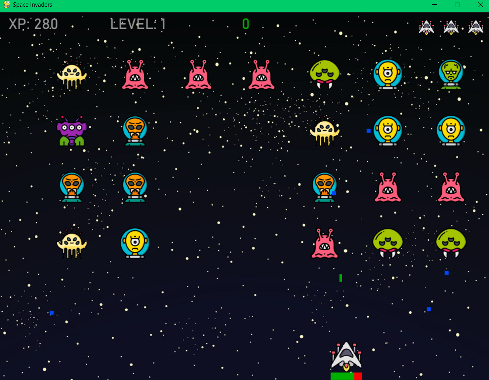
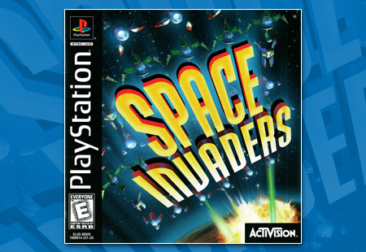

<h1>
👾 Space Invaders 👾
</h1>

---

### My First Python Project

This was my first big project in Python. After working through the No 
Starch Press book 'Python Crash Course', the final project was to build 
this game. 

My version is considerably different to the book as I spent weeks on it
trying to implement different features.

The game is incomplete, it is buggy - but it is my first working project 
that I ever made, so I decided to leave it as it is.

---

### Based on the Playstation 1 Version

Did anyone ever play this game on PS1? 

I loved this game. And intially, I had set out to make this game just like 
this version. It was going to include motherships and boss rounds - but in 
the end I had to move on to other projects ☹️

_However - I did manage to implement a couple of features from this game:_

>1. There is a special kamikaze move which will wipe out a whole column of 
  aliens. 🚀
>2. At the end of every round where there is 1 alien left in the fleet - it 
  will double the speed of that alien. I've managed to get as far as Level 
  8 myself - then it gets a bit quick 😅 

---

### The Controls

- <code>spacebar</code> - shoot!
- <code>arrow left</code> - move left
- <code>arrow right</code> - move right
- <code>arrow up</code> - kamikaze move
- <code>Q</code> - quit

### Some instructions

- When you shoot - only 3 bullets can be present on the screen at one time. 
  So no spamming the shoot button 😉
- Alien bullets are impenetrable by your bullets
- Your XP is displayed in the top left
- Your high score is displayed in green in the top center of the screen
- You have 3 lives, which are displayed in the top right of the screen

---

### Have Fun!

I hope anyone who plays this, if anything, finds it funny like I did. 

It was also very satisfying to code a working game like this - and it can 
be done from your own lounge. 20 years ago - there would have been full 
teams at companies like Activision and Rockstar making these games.

It is always a reminder how far technology has come. 🤯
